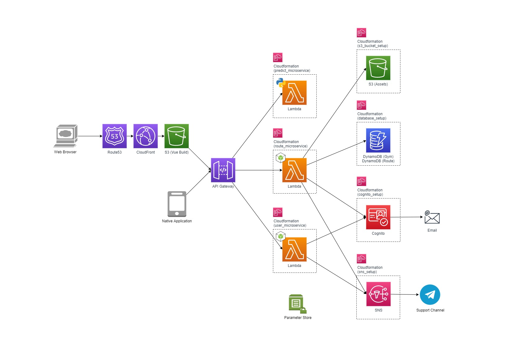

## Documentation

### Architecture



### Backend Setup

There are currently three microservices.

1. Predict: Serves Yolov4-tiny model to predict climbing holds
2. User: Provides authentication and authorization via AWS Cognito
3. Route: Provides functions related to gyms and climbing routes

API Documentation is available [here](https://nandium.github.io/RouteMaker/), ping @yarkhinephyo for a more detailed version. Postman Collections are available at `./lambda_backend/postman_collections`.

There is a bash script to setup everything via Serverless Framework. Ensure that [AWS Credentials](https://docs.aws.amazon.com/sdk-for-java/v1/developer-guide/setup-credentials.html) with administrator permissions is set up for deployment and that Docker engine is running for preparing Python packages.

```
cd ./lambda_backend
npm ci
sudo ./serverless-deploy.sh deploy dev all
```

Then should be a new file at `./lambda_backend/.env` which contains the required environment variables.

#### Telegram Notification (Optional)

Create a telegram bot. Then save the credentials as shown below before running `serverless-deploy.sh`. Notifications for the developers will be sent to the channel.

```
echo '{
  "BOT_TOKEN": "1313131313:xxxxxxxxxxxxxxxxxxxxxxxxxx",
  "BOT_CHAT_ID": "-131313131"
}' > ./lambda_backend/sns_setup/serverless-config.dev.json
```

#### New Relic Logging Dashboard (Optional)

Create a [New Relic](https://docs.newrelic.com/docs/serverless-function-monitoring/aws-lambda-monitoring/get-started/monitoring-aws-lambda-serverless-monitoring/) account. Then save the credentials as shown below before running `serverless-deploy.sh`. Cloudwatch logs and Lambda insights will be sent to the dashboard.

```
echo '{
  "NEW_RELIC_ACCOUNT_ID": 5555555,
  "NEW_RELIC_API_KEY": "XXXX-XXXXXXXXXXXXXXXXXXXXXXXXXXX"
}' | tee ./lambda_backend/user_microservice/serverless-config.dev.json >> ./lambda_backend/route_microservice/serverless-config.dev.json
```

### Frontend Setup

The Vue application can run in browser and also in Android through Capacitor plugin.

Ensure `.env` file produced from the backend setup is present in `./ionic_user_interface`. Ping @yarkhinephyo if there is any issue.

The application will work aside for the map views which require an API token from [MapBox](https://docs.mapbox.com/api/overview/). To enable the feature, append the `VUE_APP_MAPBOX_ACCESS_KEY` environment variable in the `.env` file.

For running in browser:

```
cd ./ionic_user_interface
npm ci
npm run serve
```

Ensure Android Studio is installed for building as an android application:

```
cd ./ionic_user_interface
npm ci
npm run android
```
